# Ejemplo de static_cast vs dynamic_cast

## :copyright: Autor

- :camera: 

- :man: **Daniel Morales**
- :e-mail: danielaugustoma@unitec.edu
- :link: [https://github.com/D11110](https://github.com/D11110)
- :calendar: 2020-08-30 23:00 CST

---

## :dart: Objetivos

Punto de control de **C++** #06:

:blue_book: En este se vieron temas como:
   - **static_cast** 
   - **dynamic_cast** 
   - **typeid**
   - **Sobrecarga de operadores**
   - **Funciones virtuales**

---

## :black_circle: dynamic_cast1.cpp

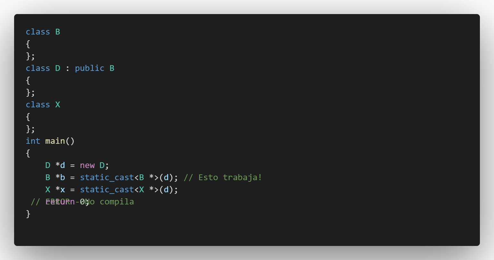

## :page_with_curl: Salida

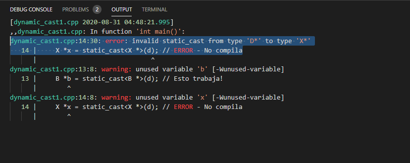

---

## :triangular_ruler: dynamic_cast2.cpp

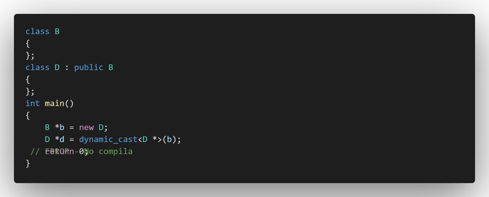

## :page_with_curl: Salida

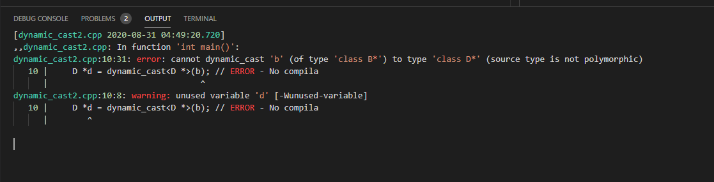

---

## :white_large_square: dynamic_cast3.cpp

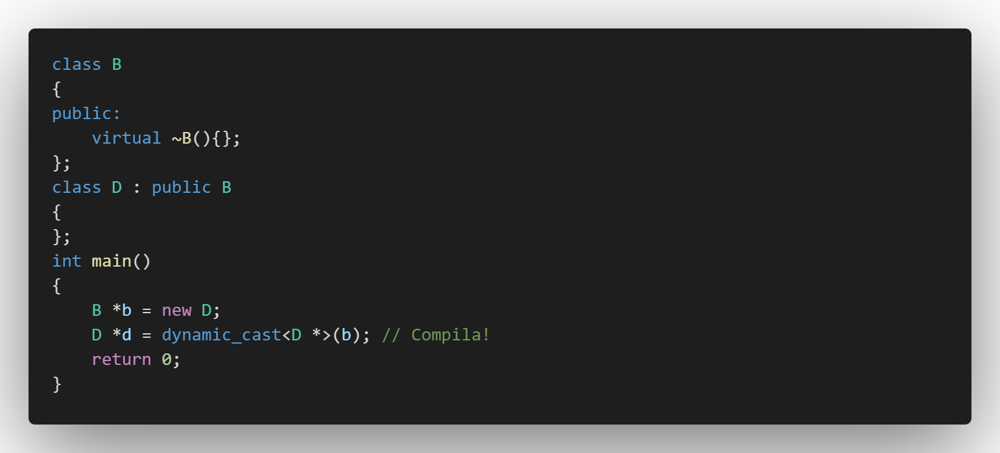

## :page_with_curl: Salida

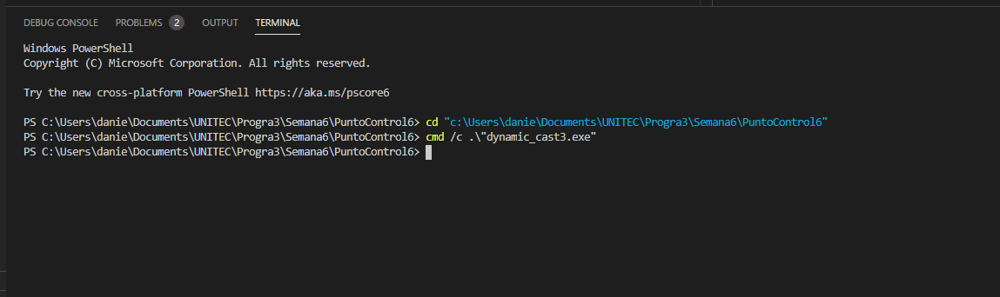

---

## :large_blue_diamond: funciones_virtuales.cpp

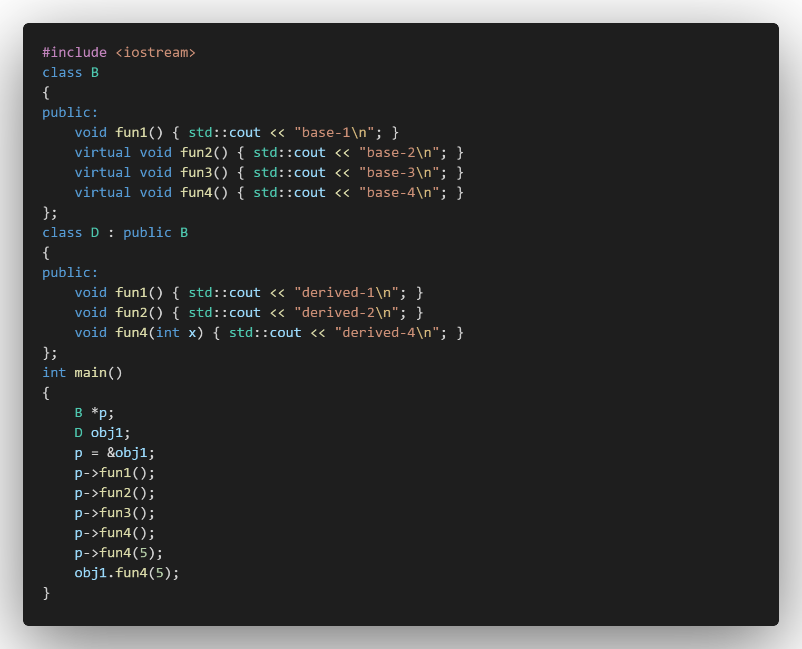

## :page_with_curl: Salida

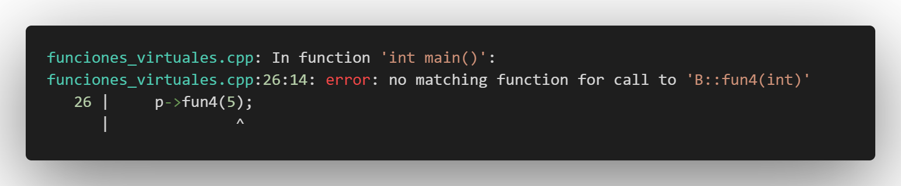

---

## :large_orange_diamond: typeid.cpp

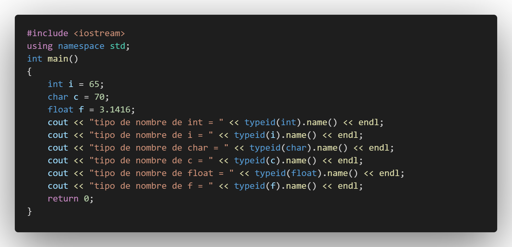

## :page_with_curl: Salida

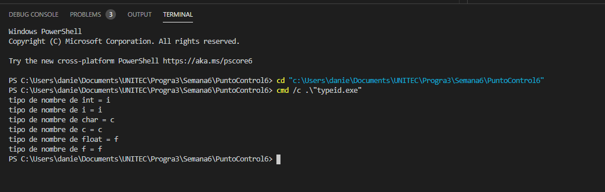

---

##  :black_large_square:  sobrecarga1.cpp

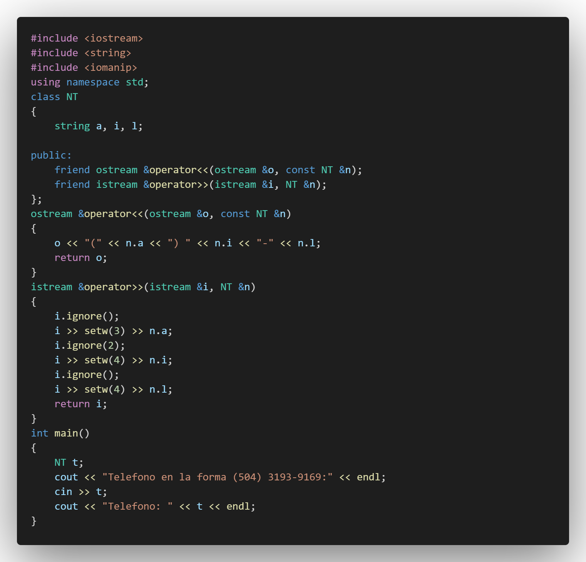

## :page_with_curl: Salida

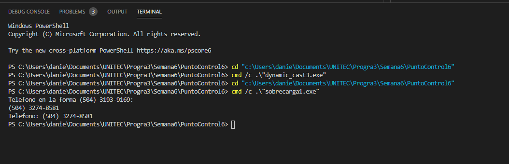

---

## :white_circle: sobrecarga2.cpp

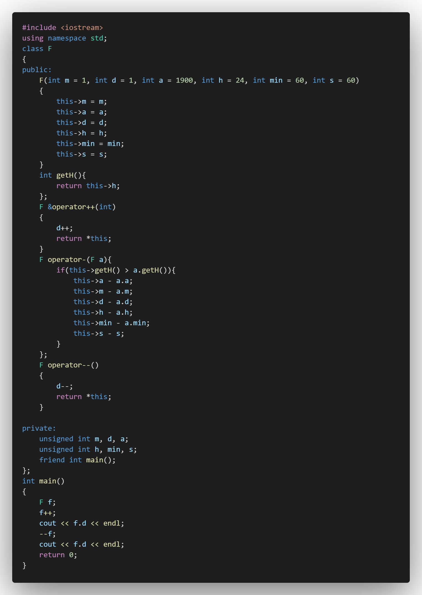

## :page_with_curl: Salida

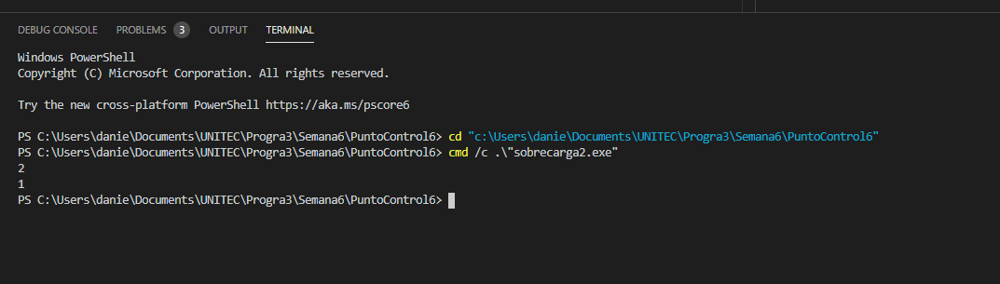

---

## :computer: Código

- :blue_book: [C-_PDC_-06](https://github.com/D11110/C-_PDC_-06)

---
#### Herramientas:
- :package: [Visual Studio Code](https://code.visualstudio.com/)
- :camera: [Polacode-2020 v0.5.2](https://github.com/jeff-hykin/polacode)
- :notebook: [Markdown Cheatsheet](https://github.com/adam-p/markdown-here/wiki/Markdown-Cheatsheet)
- :smile: [Emoji Cheat Sheet](https://www.webfx.com/tools/emoji-cheat-sheet/)